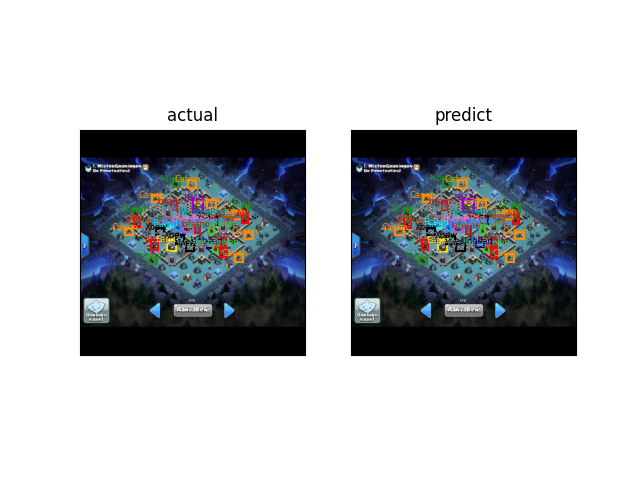
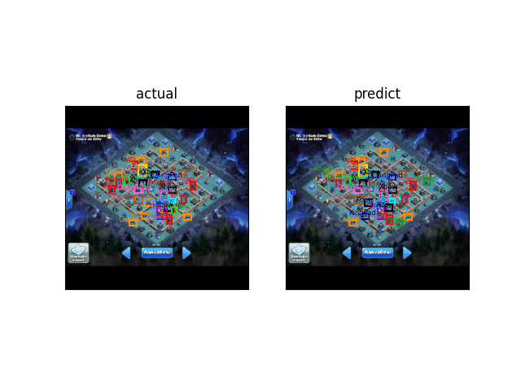

# 🏰 YOLOv10 部落冲突建筑检测系统 🏰

```
   _____ _    ___  ____  _____   _____ ___  ____  
  / ____| |  / _ \|  _ \|  __ \ / ____|__ \|___ \ 
 | (___ | |_| | | | |_) | |__) | |       ) | __) |
  \___ \|  _  | | |  _ <|  ___/| |      / / |__ < 
  ____) | | | |_| | |_) | |    | |____ / /_ ___) |
 |_____/|_|  \___/|____/|_|     \_____|____|____/ 
```

## 📌 项目概述

🔍 本项目基于 **YOLOv10** 实现了《部落冲突》游戏中建筑的自动检测与分类，主要功能包括：

```
  🏗️  支持16种建筑类型检测
  🎨  彩色编码可视化结果
  📊  标注与预测对比展示
  ⚡  高性能推理速度
```

## 🛠️ 安装指南

```bash
# 克隆仓库
git clone https://github.com/xixihaianxian/Yolo-Clash-of-Clans.git
```

## 🏆 支持检测的建筑类型

```
  ⚔️  防空火箭(AD)     🏹  X连弩(Xbow)      💣  炸弹塔(BombTower)
  🌪️  空气炮(AirSweeper) 🏯  13本大本营(TH13)   👑  蛮王祭坛(KingPad)
  🔥  地狱塔(Inferno)   🏹  投石炮(Scattershot) 👸  女王祭坛(QueenPad)
```

## 📊 效果展示

- ### 1.效果展示1
  
  

- ### 2.效果展示2
  
  

- ### 3.效果展示3
  
  

## 🚀 快速开始

```python
from ultralytics import YOLO

# 加载训练好的模型
model = YOLO('best.pt') #best.pt填写最佳模型的位置

# 运行检测
results = model('example.jpg') #exmple.pt填写待检测图片的地址
```

## 📂 项目结构

```
部落冲突检测器/
├── 📂 config/        # 配置文件
├── 📂 data/          # 数据集
├── 📂 runs/          # 训练输出
├── 📂 utils/         # 工具脚本
├── 🐍 train.py       # 训练脚本
├── 🧪 test.py        # 测试脚本
└── 📜 README.md      # 说明文档
```

## 📜 注意事项
数据来源于[Clash of Clans](https://universe.roboflow.com/find-this-base/clash-of-clans-vop4y),如有侵权请联系1668584651@qq.com

## 🌟 项目特色

```
  ✅ 专为部落冲突优化设计
  ✅ 高精度建筑识别
  ✅ 直观的对比可视化
  ✅ 易于扩展的架构
  ✅ 详细的文档说明
```